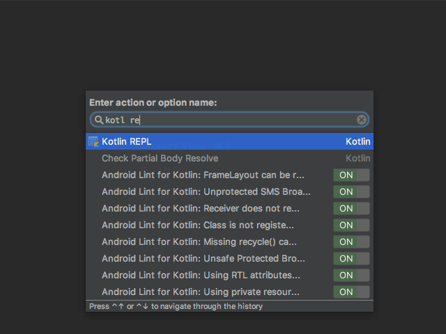
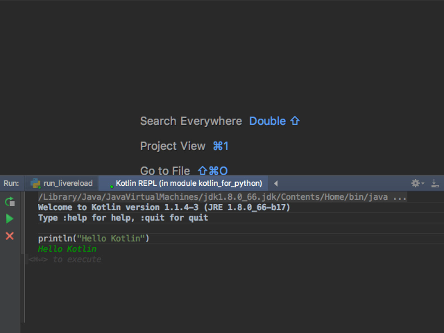
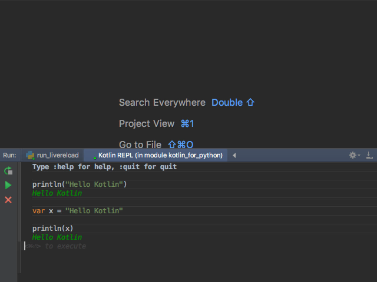

===========
Hello World
===========

Java is installed, our IDE has a project open, we're ready to write some
code. In this step we breeze through a light treatment of many Kotlin
concepts, all from the Python perspective.

The REPL
========

Python has an interactive interpreter, aka REPL, which makes it easy to
play around and learn. It's a dynamic language, so this makes sense. As
it turns out, Kotlin (in IntelliJ) has a REPL also.

Opening the Kotlin REPL is easy. You can use the ``Tools | Kotlin`` menu
or search for the action:

In Python we have the ``Python Console`` tool window, which opens the
Python interpreter in the context of your project. The Kotlin REPL is
the same idea.

Let's type in some code:

Here we typed a line of Kotlin code and executed it with ``Cmd-Enter`` (macOS.)
We could have clicked the green play button, which triggers the run action
just like ``Cmd-Enter``. Kotlin evaluated our line, letting Kotlin/Java do
a mountain of machinery behind the scenes.

The REPL can handle multiple lines:

As this is our first foray into Kotlin, let's analyze this small bit of
code from the Python perspective:

.. code-block:: kotlin
    :linenos:

    val msg = "Hello Kotlin"
    print(msg)

- We declare variables with ``var`` (which allows re-assignment) or
  ``val`` (which is like a constant). Python doesn't have ``var``.

- Double quotes for strings

- No semicolons!

- A print *function* (like Python 3, but unlike Python 2)

All in all...other than ``var``, it's exactly like Python.

Click the red X to close the REPL and let's start writing some Kotlin code.

.. raw:: html

  <iframe src="https://drive.google.com/file/d/0ByDKocMZdLZLeEZjVDd6MUVDckk/preview"
          width="640" height="480"
          style="margin-bottom: 2em"></iframe>

First File
==========

In Python, we'd make a ``.py`` file and start typing in some code. From
Python's semantics, there are almost no rules about the file itself -- name,
location, etc. For example, here is a minimum ``hello_world.py``:

.. literalinclude:: hello_world_minimum.py
    :linenos:

We can start the same in Kotlin. IntelliJ has created a ``src`` directory
for you. Right-click on that and create a file at
``src/hello_world/hello_world.kt``:

.. literalinclude:: ../../src/hello_world/hello_world.kt
    :language: kotlin
    :linenos:

Here's the equivalent Python file to mimic a main function:

.. literalinclude:: hello_world_basic.py
    :linenos:

Python uses ``def`` to define a function, Kotlin uses ``fun``. We'll talk
more about this in :doc:`../functions/index`.

The Kotlin file shows the standard Kotlin "entry point": by convention,
the file being executed must have a function named ``main`` which accepts
a single argument, an array of strings. Kotlin itself then calls this
main function. This is a *bit* similar to the common (but not required)
Python run block. For example, this file in Python might look like this:

.. literalinclude:: hello_world_main.py
    :linenos:

In this Python example, we had to both detect that the module was
being run (instead of imported) and then call the appropriate "main"
function.

We saw strong typing in the Kotlin function definition. Python of course
has typing, but it is at run time and is inferred. (We'll discuss
type hinting in the section on :doc:`../variables/index`.)

Time to run this, which really means, compile and execute. If you're
familiar with PyCharm run configurations and gutter icons, it's
similar. Click the Kotlin symbol in the gutter for line 1 and select
``Run``:

[TODO screenshot of running it]

.. note::

    IntelliJ prompted us to ``Run 'Hello_worldKT'``. What's
    ``Hello_worldKT``? Answer: To make Java happy, Kotlin generated
    a Java class behind the scenes.

When you clicked this, there was a lag that you don't get in Python.
This the build/compile phases from Java. It's incremental, so it
is faster after the first time.

Now that we've run our program, let's breeze through some
head-to-head comparisons on a few programming language basics.

Braces
======

This is the most obvious point: like most other programming languages,
Kotlin delimits blocks with braces. Python uses indentation.

Quotation Marks
===============

Switching between languages, or even projects, means swinging back
and forth between single versus double quotes for strings. For example,
TypeScript prefers double quotes, but ReactJS ES6 applications prefer
single quotes. And they are both (sort of) JavaScript!

Python's ``PEP 8`` style guide doesn't prefer one or the other, but
most Python projects seem to use single quotes. In fact, Python has
triple quoted strings!

.. code-block:: python
    :linenos:

    # Python
    hello = 'world'         # best
    hello = "world"         # ok
    hello = """
       world"""             # triple

Java (and Kotlin) use a single quote for a single character value and
double quotes for strings. Triple-quotes indicates a
`raw string <https://kotlinlang.org/docs/reference/basic-types.html#strings>`_:

.. code-block:: kotlin
    :linenos:

    // Kotlin
    val c = 'C'             // character
    val hello = "hello"     // string
    val raw_string = """
        line 1
        line 2
    """

Comments
========

Kotlin supports the two familiar styles of comments: end-of-line and
block comments:

.. code-block:: kotlin
    :linenos:

    val hello = "world"     // Kotlin line comment
    /*
        Let's leave out
        these lines
    */

IntelliJ (and thus PyCharm) as an IDE makes it easy to comment and uncomment
lines and selections with ``Cmd-/``.

Python, of course, only uses hash ``#`` as the comment symbol,
with no block comments:

.. code-block:: python
    :linenos:

    #
    # Python multiline commments
    # have a lot of hashes.

    hello = 'world'  # Python comment

Variables
=========

Python doesn't have any special syntax for declaring a variable. You
just assign something:

.. code-block:: python
    :linenos:

    # Python
    hello = 'world'

Kotlin, though, does. In fact Kotlin has two keywords: one to declare
a read-only *immutable* value, and one for a *mutable* variable:

.. code-block:: kotlin
    :linenos:

    // Kotlin
    val hello = "world"     // Read-only, val == value
    var hello = "world"     // Can be re-assigned, var == variable

Where's the Java-style type noise? Good news -- Kotlin can infer the type.
The above is the same as being explicit:

.. code-block:: kotlin
    :linenos:

    // Kotlin
    val hello: String = "hello"

Also, like Python, you can initialize a variable without
assigning it:

.. code-block:: kotlin
    :linenos:

    // Kotlin
    var hello

Of course with Python 3.6 variable annotations, we can make Python look
much more like Kotlin. We cover this in the section on :doc:`../variables/index`.

String Templates
================

Python -- the "there should be one way to do things" language --
actually has *several* ways to do string templates:

.. code-block:: python
    :linenos:

    # Python
    msg = 'World'
    print('Hello %s' % msg)                 # Original
    print('Hello {msg}'.format(msg=msg))    # Python 3 (then 2)
    print(f'Hello {msg}')                   # Python 3.6
    print(f'Hello {msg.upper()}')           # Expressions

Kotlin also has string templates with expressions:

.. code-block:: kotlin
    :linenos:

    // Kotlin
    msg = "World"
    print("Hello $msg")
    print("Hello ${msg.toUpperCase()}")

Functions
=========

Python functions can be very simple:

.. code-block:: python
    :linenos:

    # Python
    def four():
        return 2 + 2

No curly braces, just indentation. Kotlin's simplest case is pretty close:

.. code-block:: kotlin
    :linenos:

    // Kotlin
    fun four(): Int {
        return 2 + 2
    }

Kotlin adds the curly braces and has to define the return type (which can
be omitted if there is no return value.)

But watch this -- a function *expression*:

.. code-block:: kotlin
    :linenos:

    // Kotlin
    fun four() = 2 + 2

Admit it, that's pretty sexy. Function expressions are a big new idea
which we'll cover in the section on :doc:`../functions/index`.

Passing in function arguments is straightforward in Python:

.. code-block:: python
    :linenos:

    # Python
    def combine(x, y):
        return x + y

How does that compare to Kotlin?

.. code-block:: kotlin
    :linenos:

    // Kotlin
    fun sum(a: Int, b: Int): Int {
        return a + b
    }

You have to provide the type information on the function arguments and
return value.

Conditionals
============

Let's take a quick look at things like conditionals and looping.  In
Python, an ``if/then/else`` is straightforward, with use of indentation:

.. code-block:: python
    :linenos:

    # Python
    if a > b:
        return a
    else:
        return b

Kotlin looks quite similar, adding parenthesis (optional in Python) and
braces:

.. code-block:: kotlin
    :linenos:

    // Kotlin
    if (a > b) {
        return a
    } else {
        return b
    }

We'll cover more on this in :doc:`../conditionals/index`.

Looping
=======

Let's compare looping over sequences. Simple Python example:

.. code-block:: python
    :linenos:

    # Python
    items = ('apple', 'banana', 'kiwi')
    for item in items:
        print(item)

Here we've created an immutable sequence (a tuple) in ``items``. We looped
over it in the most basic way possible.

In Kotlin, we have a different construct for making the sequence. Looping
is similar, though we use a parentheses after ``for``:

.. code-block:: kotlin
    :linenos:

    // Kotlin
    val items = listOf("apple", "banana", "kiwi")
    for (item in items) {
        println(item)
    }

In this case we used ``println``. In Python, the ``print`` function always
makes a newline unless you ask it not to.

Both Python and Kotlin have rich and interesting control structures,
giving both power and terseness. We'll see more in :doc:`../sequences/index`.

Classes
=======

Lots to cover later on this, so for now, let's just view the simplest couple
of cases. The minimum in Python:

.. code-block:: python
    :linenos:

    # Python
    class Message:
        pass

In Kotlin:

.. code-block:: kotlin
    :linenos:

    // Kotlin
    class Message

It's hard to tell which of those have the smaller conceptual density. And
who cares -- they're both tiny! Let's add a constructor, some variables,
and methods. First in Python:

.. code-block:: python
    :linenos:

    # Python
    class Message:
        greeting = 'Hello'

        def __init__(self, person):
            self.person = person

        def say_hello(self):
            return f'{self.greeting} {self.person}'

This class has a "constructor" with one argument, which is assigned as an
instance attribute. The class attribute of ``greeting`` is used in a
method ``say_hello`` which returns an evaluated f-string.

How about the type hinting flavor for Python 3.5+?

.. code-block:: python
    :linenos:

    # Python
    class Message:
        greeting = 'Hello'

        def __init__(self, person: str):
            self.person = person

        def say_hello(self) -> str:
            return f'{self.greeting} {self.person}'

Let's see this in Kotlin:

.. code-block:: kotlin
    :linenos:

    // Kotlin
    class Message(val person: String) {
        val greeting = "Hello"

        fun sayHello(): String {
            return "$greeting $person"
        }
    }

That constructor syntax, right in the middle of the class name line, is
unusual and cool. It helps to reduce the typing versus Python's constructor.
We'll go into more depth on this in the section on :doc:`../classes/index`.